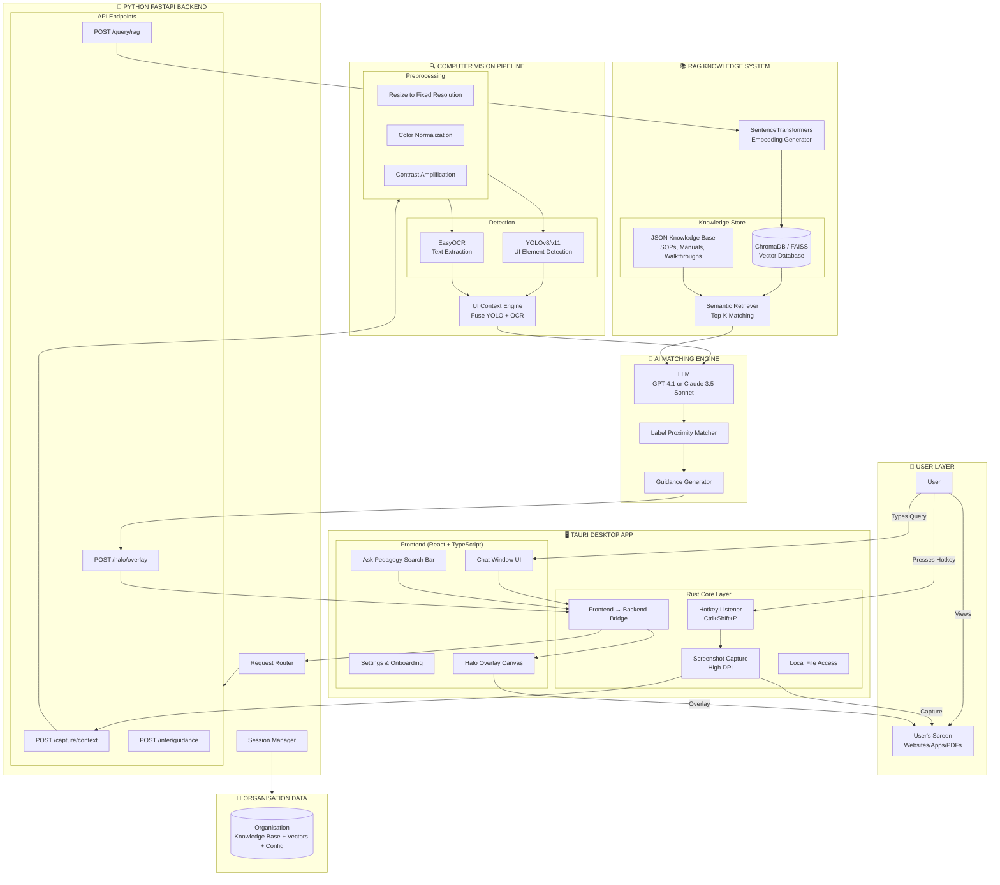
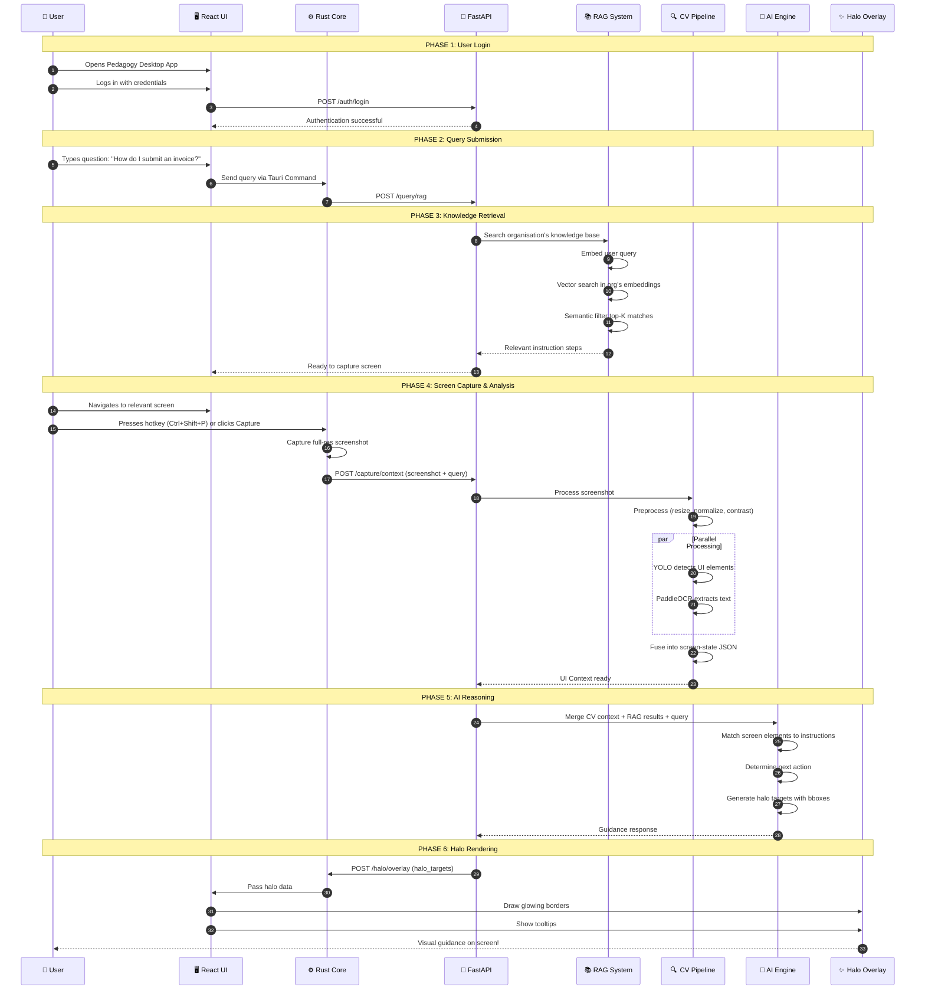
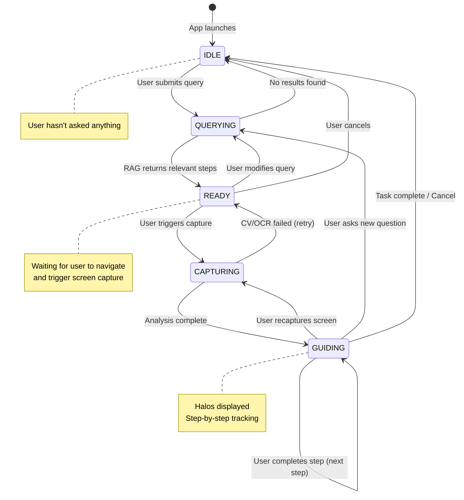
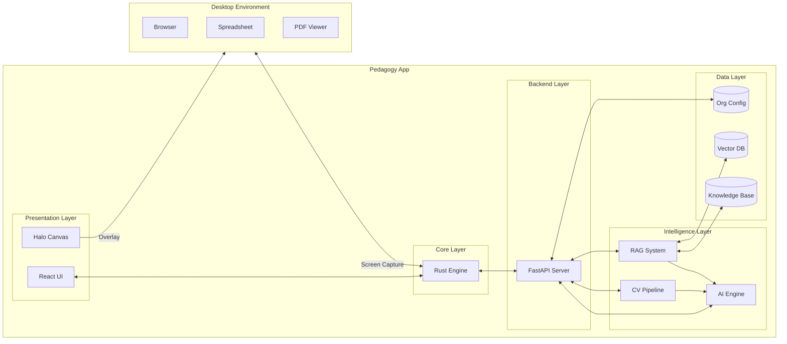
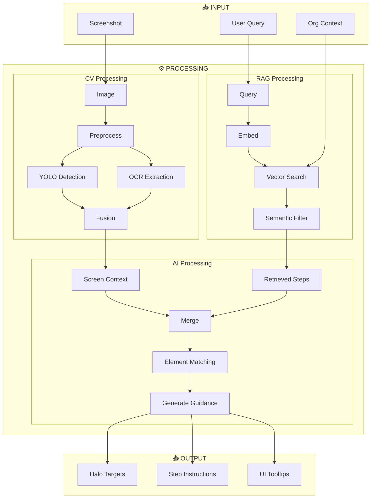
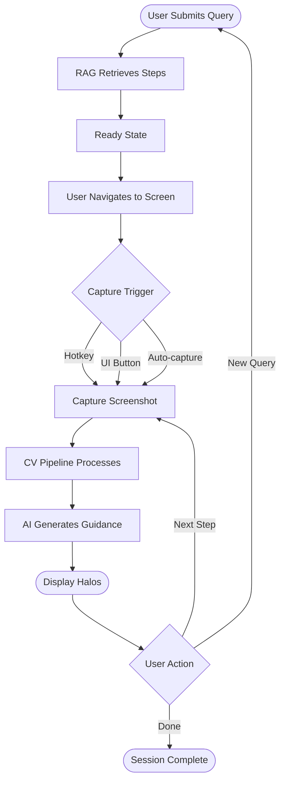

# Pedagogy - High-Level End-to-End Architecture Diagram

## 1. Complete System Architecture

## 2. End-to-End User Flow

## 3. State Machine Diagram

## 4. Component Interaction Diagram

## 5. Data Flow Diagram

## 6. Capture Trigger Flow

## How to View These Diagrams

1. **VS Code**: Install "Markdown Preview Mermaid Support" extension
2. **GitHub**: Paste this file - GitHub renders Mermaid natively
3. **Online**: Use [Mermaid Live Editor](https://mermaid.live/)
4. **Export**: Use Mermaid CLI to export as PNG/SVG
