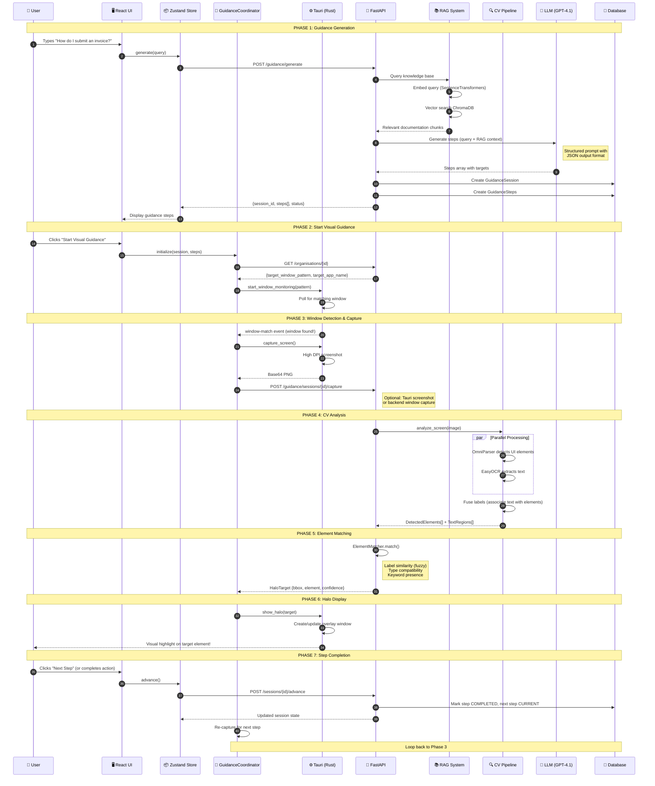
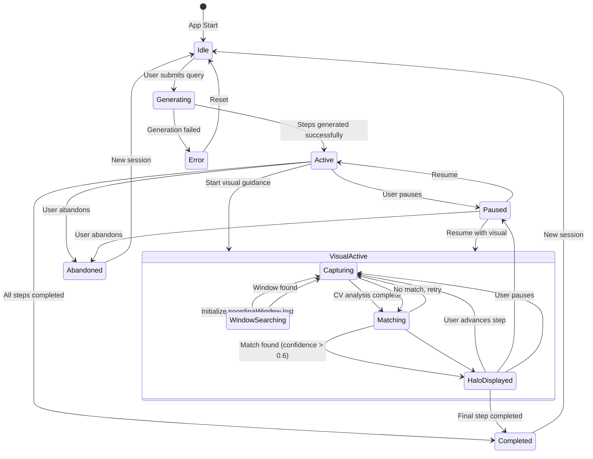
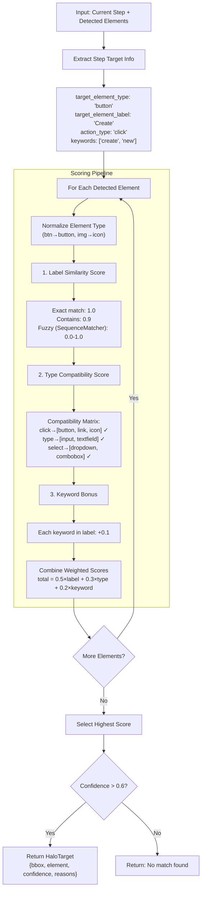
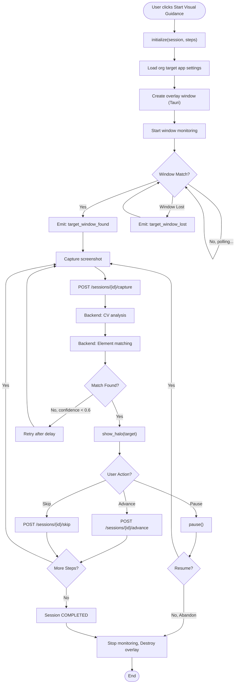
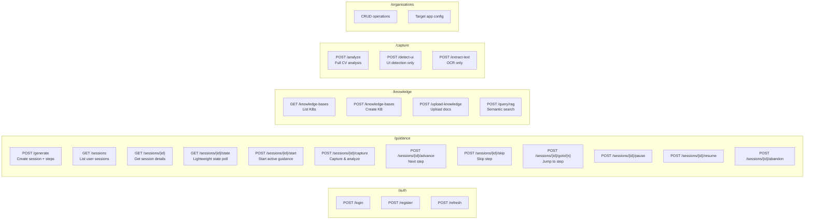
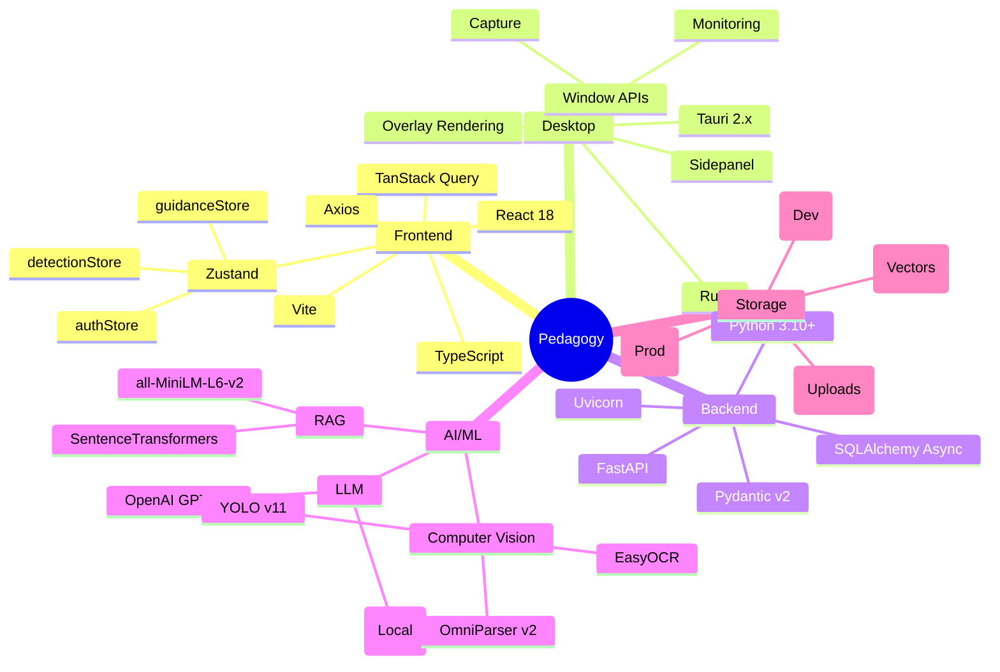
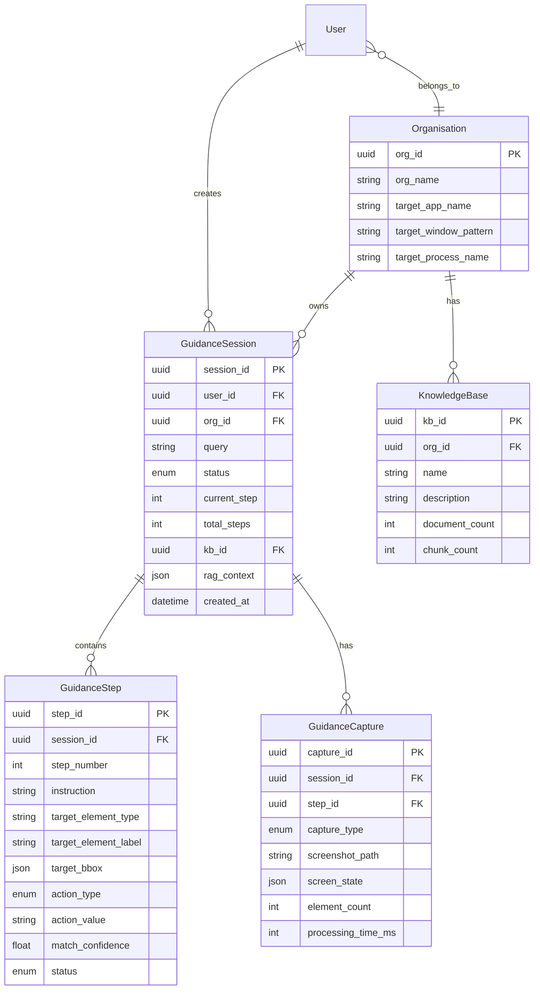
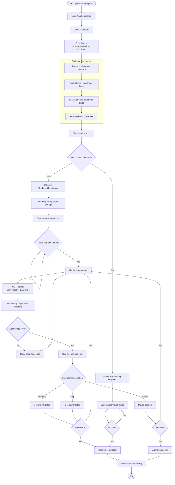

# Pedagogy - Complete System Architecture

## 1. High-Level System Overview

```mermaid
flowchart TB
    subgraph User["👤 USER"]
        U[User]
        TargetApp[Target Application<br/>Salesforce/CRM/etc.]
    end

    subgraph TauriApp["🖥️ TAURI DESKTOP APP"]
        subgraph ReactFrontend["Frontend (React + TypeScript)"]
            subgraph Pages["Pages"]
                GP[GuidancePage]
                HP[HistoryPage]
                PP[ProfilePage]
            end

            subgraph Components["Components"]
                GQP[GuidanceQueryPanel]
                GSP[GuidanceSessionPanel]
                HaloComp[HaloOverlay Component]
            end

            subgraph StateLayer["State Management (Zustand)"]
                GuidanceStore[guidanceStore]
                DetectionStore[detectionStore]
                AuthStore[authStore]
            end

            subgraph Hooks["Hooks"]
                UseGuidance[useGuidance]
                UseGuidanceCoord[useGuidanceCoordinator]
                UseDetection[useDetection]
            end

            subgraph Services["Frontend Services"]
                GuidanceCoord[GuidanceCoordinator<br/>Singleton]
            end

            subgraph APIClients["API Clients (Axios)"]
                GuidanceAPI[guidance.ts]
                DetectionAPI[detection.ts]
                HaloAPI[halo.ts]
                KnowledgeAPI[knowledge.ts]
            end
        end

        subgraph RustLayer["Rust Core Layer"]
            subgraph TauriCommands["Tauri Commands"]
                DetectionCmds[detection_commands.rs]
                HaloCmds[halo_commands.rs]
                SidepanelCmds[sidepanel_commands.rs]
            end

            subgraph RustModules["Rust Modules"]
                DetectionMod[Detection Module<br/>Window Monitor]
                OverlayMod[Overlay Module<br/>Halo Renderer]
                SidepanelMod[Sidepanel Module]
            end

            OverlayWindow[Overlay Window<br/>Transparent]
            SidepanelWindow[Sidepanel Window]
        end
    end

    subgraph Backend["🐍 PYTHON FASTAPI BACKEND"]
        subgraph APIRoutes["API Routes"]
            GuidanceRoute[/guidance<br/>Session Management]
            KnowledgeRoute[/knowledge<br/>RAG & Upload]
            CaptureRoute[/capture<br/>CV Analysis]
            OrgRoute[/organisations<br/>Config]
            AuthRoute[/auth<br/>Authentication]
        end

        subgraph AIEngine["AI Engine"]
            GuidanceGen[GuidanceGenerator<br/>Orchestrator]
            AIReasoner[AIReasoner<br/>LLM Integration]
            ElementMatcher[ElementMatcher<br/>Fuzzy Matching]
            StepTracker[StepTracker<br/>Session State]
        end

        subgraph LLMClients["LLM Clients"]
            OpenAIClient[OpenAI Client<br/>GPT-4.1]
            OllamaClient[Ollama Client<br/>Local LLM]
        end

        subgraph CVPipeline["CV Pipeline"]
            CVService[CVService]
            OmniParser[OmniParser v2<br/>UI Detection]
            YOLOv11[YOLO v11<br/>Fallback]
            EasyOCR[EasyOCR<br/>Text Extraction]
        end

        subgraph RAGSystem["RAG System"]
            KnowledgeService[KnowledgeService]
            SentenceTransformers[SentenceTransformers<br/>all-MiniLM-L6-v2]
            ChromaDB[(ChromaDB<br/>Vector Store)]
        end

        subgraph DataLayer["Data Layer"]
            SQLite[(SQLite/PostgreSQL<br/>Sessions, Users, Orgs)]
            FileStorage[File Storage<br/>Uploads, Screenshots]
        end
    end

    %% User Interactions
    U -->|Query & Actions| GP
    U -->|Views| TargetApp
    TargetApp -.->|Captured| DetectionMod

    %% Frontend Flow
    GP --> GQP
    GP --> GSP
    GSP --> HaloComp
    GQP --> UseGuidance
    GSP --> UseGuidanceCoord
    UseGuidance --> GuidanceStore
    UseGuidanceCoord --> GuidanceCoord
    GuidanceCoord --> GuidanceStore
    GuidanceStore --> GuidanceAPI

    %% Tauri IPC
    GuidanceCoord -->|invoke| DetectionCmds
    GuidanceCoord -->|invoke| HaloCmds
    DetectionCmds --> DetectionMod
    HaloCmds --> OverlayMod
    OverlayMod --> OverlayWindow
    OverlayWindow -.->|Overlay on| TargetApp

    %% Frontend to Backend HTTP
    GuidanceAPI -->|HTTP| GuidanceRoute
    KnowledgeAPI -->|HTTP| KnowledgeRoute
    DetectionAPI -->|HTTP| CaptureRoute

    %% Backend Internal Flow
    GuidanceRoute --> GuidanceGen
    GuidanceGen --> AIReasoner
    GuidanceGen --> ElementMatcher
    GuidanceGen --> StepTracker
    AIReasoner --> OpenAIClient
    AIReasoner --> OllamaClient
    StepTracker --> SQLite

    GuidanceRoute --> CVService
    CVService --> OmniParser
    CVService --> YOLOv11
    CVService --> EasyOCR

    KnowledgeRoute --> KnowledgeService
    KnowledgeService --> SentenceTransformers
    KnowledgeService --> ChromaDB
```

## 2. Complete Data Flow Sequence



## 3. Component Architecture Layers

```mermaid
flowchart LR
    subgraph Presentation["PRESENTATION LAYER"]
        direction TB
        Pages[Pages<br/>GuidancePage, HistoryPage]
        Components[Components<br/>Panels, Overlays, UI]
    end

    subgraph State["STATE LAYER"]
        direction TB
        Zustand[Zustand Stores<br/>guidance, detection, auth]
        Hooks[React Hooks<br/>useGuidance, useGuidanceCoordinator]
    end

    subgraph Orchestration["ORCHESTRATION LAYER"]
        direction TB
        Coordinator[GuidanceCoordinator<br/>Session lifecycle, Capture loop]
        APIClient[API Clients<br/>Axios HTTP calls]
    end

    subgraph Desktop["DESKTOP LAYER (Tauri/Rust)"]
        direction TB
        Commands[Tauri Commands<br/>IPC Bridge]
        Detection[Window Detection<br/>Pattern matching, Polling]
        Capture[Screen Capture<br/>High DPI, Region capture]
        Overlay[Overlay Window<br/>Transparent, Always-on-top]
    end

    subgraph API["API LAYER (FastAPI)"]
        direction TB
        Routes[REST Endpoints<br/>/guidance, /capture, /knowledge]
        Services[Services<br/>CVService, KnowledgeService]
    end

    subgraph AI["AI LAYER"]
        direction TB
        Generator[GuidanceGenerator<br/>Orchestration]
        Reasoner[AIReasoner<br/>LLM prompting]
        Matcher[ElementMatcher<br/>Fuzzy matching]
        Tracker[StepTracker<br/>Session state]
    end

    subgraph ML["ML LAYER"]
        direction TB
        LLM[LLM Clients<br/>OpenAI, Ollama]
        CV[CV Pipeline<br/>OmniParser, YOLO, EasyOCR]
        RAG[RAG System<br/>Embeddings, ChromaDB]
    end

    subgraph Data["DATA LAYER"]
        direction TB
        SQL[(SQLite/PostgreSQL)]
        Vector[(ChromaDB)]
        Files[File Storage]
    end

    Presentation --> State
    State --> Orchestration
    Orchestration --> Desktop
    Orchestration --> API
    API --> AI
    AI --> ML
    ML --> Data
    API --> Data
```



## 4. Session State Machine



## 5. Element Matching Algorithm Flow



## 6. GuidanceCoordinator Lifecycle



## 7. API Endpoints Map



## 8. Technology Stack Mind Map



## 9. Database Schema Relationships



## 10. Complete User Journey Flow



---

## How to View These Diagrams

1. **VS Code**: Install "Markdown Preview Mermaid Support" extension
2. **GitHub**: GitHub renders Mermaid natively in markdown files
3. **Online**: Use [Mermaid Live Editor](https://mermaid.live/)
4. **Export**: Use Mermaid CLI (`mmdc`) to export as PNG/SVG

---

## Key Files Reference

| Layer | Key Files |
|-------|-----------|
| **Frontend Pages** | `src/pages/dashboard/GuidancePage.tsx` |
| **Frontend Components** | `src/components/guidance/GuidanceSessionPanel.tsx`, `GuidanceQueryPanel.tsx` |
| **State Management** | `src/stores/guidanceStore.ts`, `detectionStore.ts` |
| **Coordinator** | `src/services/GuidanceCoordinator.ts` |
| **API Clients** | `src/api/guidance.ts`, `detection.ts`, `halo.ts` |
| **Tauri Commands** | `src-tauri/src/commands/detection_commands.rs`, `halo_commands.rs` |
| **Backend Routes** | `backend/app/api/guidance.py`, `knowledge.py`, `cv_analysis.py` |
| **AI Engine** | `backend/app/ai_engine/guidance_generator.py`, `matcher.py`, `reasoner.py` |
| **Services** | `backend/app/services/cv_service.py`, `knowledge_service.py` |
| **Models** | `backend/app/models/guidance.py`, `organisation.py` |
