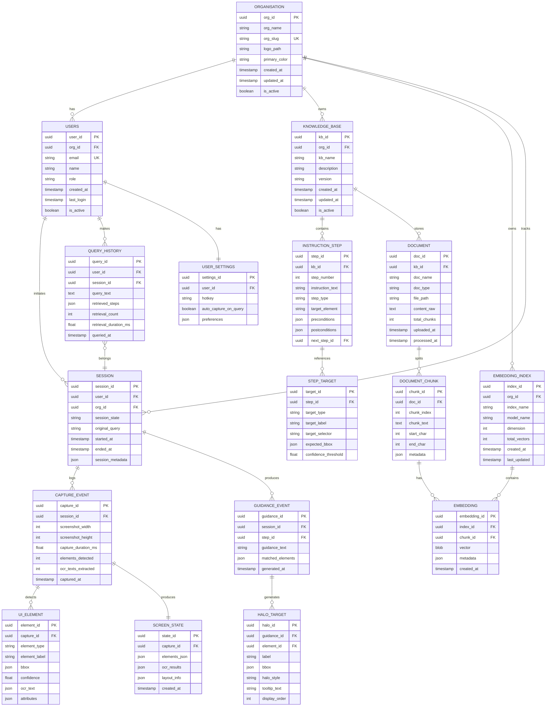
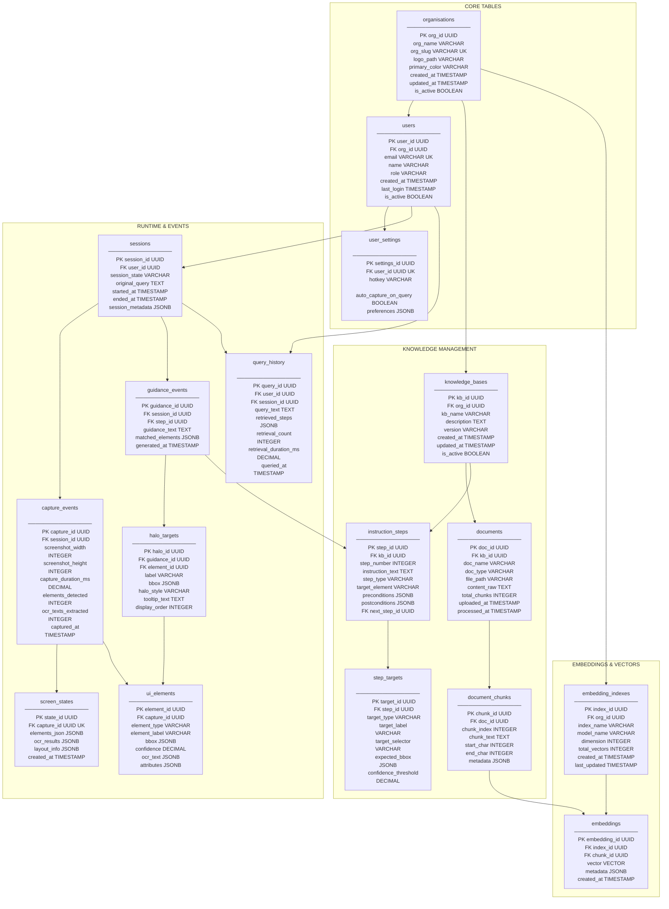
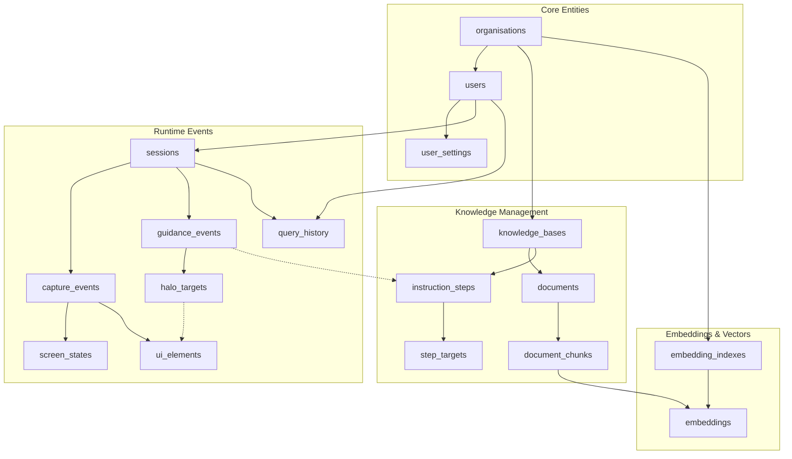
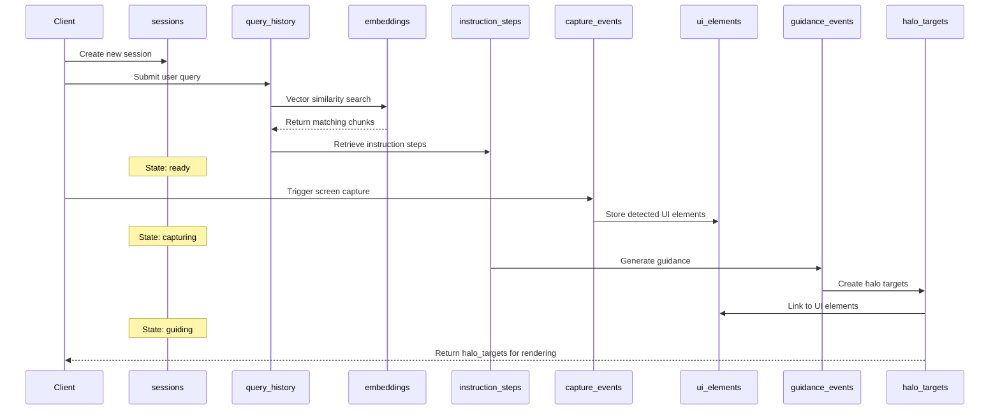

# Pedagogy - Database Schema Design

## 1. Entity Relationship Diagram (ERD)



## 2. SQL Schema Diagram (Tables & Relationships)



## 3. SQL DDL Statements

```sql
-- =============================================
-- PEDAGOGY DATABASE SCHEMA
-- PostgreSQL with pgvector extension
-- =============================================

-- Enable required extensions
CREATE EXTENSION IF NOT EXISTS "uuid-ossp";
CREATE EXTENSION IF NOT EXISTS "vector";

-- =============================================
-- CORE ORGANISATION TABLES
-- =============================================

CREATE TABLE organisations (
    org_id UUID PRIMARY KEY DEFAULT uuid_generate_v4(),
    org_name VARCHAR(255) NOT NULL,
    org_slug VARCHAR(100) UNIQUE NOT NULL,
    logo_path VARCHAR(500),
    primary_color VARCHAR(7) DEFAULT '#3B82F6',
    created_at TIMESTAMP WITH TIME ZONE DEFAULT CURRENT_TIMESTAMP,
    updated_at TIMESTAMP WITH TIME ZONE DEFAULT CURRENT_TIMESTAMP,
    is_active BOOLEAN DEFAULT TRUE
);

CREATE INDEX idx_organisations_slug ON organisations(org_slug);
CREATE INDEX idx_organisations_active ON organisations(is_active);

-- =============================================
-- USER TABLES
-- =============================================

CREATE TABLE users (
    user_id UUID PRIMARY KEY DEFAULT uuid_generate_v4(),
    org_id UUID NOT NULL REFERENCES organisations(org_id) ON DELETE CASCADE,
    email VARCHAR(255) UNIQUE NOT NULL,
    name VARCHAR(255) NOT NULL,
    role VARCHAR(50) DEFAULT 'user' CHECK (role IN ('admin', 'user', 'viewer')),
    created_at TIMESTAMP WITH TIME ZONE DEFAULT CURRENT_TIMESTAMP,
    last_login TIMESTAMP WITH TIME ZONE,
    is_active BOOLEAN DEFAULT TRUE
);

CREATE INDEX idx_users_org ON users(org_id);
CREATE INDEX idx_users_email ON users(email);

CREATE TABLE user_settings (
    settings_id UUID PRIMARY KEY DEFAULT uuid_generate_v4(),
    user_id UUID UNIQUE NOT NULL REFERENCES users(user_id) ON DELETE CASCADE,
    hotkey VARCHAR(50) DEFAULT 'Ctrl+Shift+P',
    auto_capture_on_query BOOLEAN DEFAULT FALSE,
    preferences JSONB DEFAULT '{}'::jsonb
);

-- =============================================
-- KNOWLEDGE BASE TABLES
-- =============================================

CREATE TABLE knowledge_bases (
    kb_id UUID PRIMARY KEY DEFAULT uuid_generate_v4(),
    org_id UUID NOT NULL REFERENCES organisations(org_id) ON DELETE CASCADE,
    kb_name VARCHAR(255) NOT NULL,
    description TEXT,
    version VARCHAR(50) DEFAULT '1.0.0',
    created_at TIMESTAMP WITH TIME ZONE DEFAULT CURRENT_TIMESTAMP,
    updated_at TIMESTAMP WITH TIME ZONE DEFAULT CURRENT_TIMESTAMP,
    is_active BOOLEAN DEFAULT TRUE
);

CREATE INDEX idx_knowledge_bases_org ON knowledge_bases(org_id);

CREATE TABLE documents (
    doc_id UUID PRIMARY KEY DEFAULT uuid_generate_v4(),
    kb_id UUID NOT NULL REFERENCES knowledge_bases(kb_id) ON DELETE CASCADE,
    doc_name VARCHAR(255) NOT NULL,
    doc_type VARCHAR(50) NOT NULL CHECK (doc_type IN ('sop', 'manual', 'walkthrough', 'ui_description', 'other')),
    file_path VARCHAR(500),
    content_raw TEXT,
    total_chunks INTEGER DEFAULT 0,
    uploaded_at TIMESTAMP WITH TIME ZONE DEFAULT CURRENT_TIMESTAMP,
    processed_at TIMESTAMP WITH TIME ZONE
);

CREATE INDEX idx_documents_kb ON documents(kb_id);
CREATE INDEX idx_documents_type ON documents(doc_type);

CREATE TABLE document_chunks (
    chunk_id UUID PRIMARY KEY DEFAULT uuid_generate_v4(),
    doc_id UUID NOT NULL REFERENCES documents(doc_id) ON DELETE CASCADE,
    chunk_index INTEGER NOT NULL,
    chunk_text TEXT NOT NULL,
    start_char INTEGER NOT NULL,
    end_char INTEGER NOT NULL,
    metadata JSONB DEFAULT '{}'::jsonb,
    UNIQUE(doc_id, chunk_index)
);

CREATE INDEX idx_document_chunks_doc ON document_chunks(doc_id);

-- =============================================
-- INSTRUCTION STEP TABLES
-- =============================================

CREATE TABLE instruction_steps (
    step_id UUID PRIMARY KEY DEFAULT uuid_generate_v4(),
    kb_id UUID NOT NULL REFERENCES knowledge_bases(kb_id) ON DELETE CASCADE,
    step_number INTEGER NOT NULL,
    instruction_text TEXT NOT NULL,
    step_type VARCHAR(50) NOT NULL CHECK (step_type IN ('navigation', 'input', 'click', 'select', 'verify', 'wait', 'other')),
    target_element VARCHAR(255),
    preconditions JSONB DEFAULT '[]'::jsonb,
    postconditions JSONB DEFAULT '[]'::jsonb,
    next_step_id UUID REFERENCES instruction_steps(step_id) ON DELETE SET NULL
);

CREATE INDEX idx_instruction_steps_kb ON instruction_steps(kb_id);
CREATE INDEX idx_instruction_steps_number ON instruction_steps(kb_id, step_number);

CREATE TABLE step_targets (
    target_id UUID PRIMARY KEY DEFAULT uuid_generate_v4(),
    step_id UUID NOT NULL REFERENCES instruction_steps(step_id) ON DELETE CASCADE,
    target_type VARCHAR(50) NOT NULL CHECK (target_type IN ('button', 'input', 'dropdown', 'checkbox', 'link', 'text', 'menu', 'tab', 'other')),
    target_label VARCHAR(255),
    target_selector VARCHAR(255),
    expected_bbox JSONB,
    confidence_threshold DECIMAL(3,2) DEFAULT 0.80 CHECK (confidence_threshold >= 0 AND confidence_threshold <= 1)
);

CREATE INDEX idx_step_targets_step ON step_targets(step_id);

-- =============================================
-- EMBEDDING TABLES (Vector Search)
-- =============================================

CREATE TABLE embedding_indexes (
    index_id UUID PRIMARY KEY DEFAULT uuid_generate_v4(),
    org_id UUID NOT NULL REFERENCES organisations(org_id) ON DELETE CASCADE,
    index_name VARCHAR(255) NOT NULL,
    model_name VARCHAR(100) NOT NULL DEFAULT 'all-MiniLM-L6-v2',
    dimension INTEGER NOT NULL DEFAULT 384,
    total_vectors INTEGER DEFAULT 0,
    created_at TIMESTAMP WITH TIME ZONE DEFAULT CURRENT_TIMESTAMP,
    last_updated TIMESTAMP WITH TIME ZONE DEFAULT CURRENT_TIMESTAMP
);

CREATE INDEX idx_embedding_indexes_org ON embedding_indexes(org_id);

CREATE TABLE embeddings (
    embedding_id UUID PRIMARY KEY DEFAULT uuid_generate_v4(),
    index_id UUID NOT NULL REFERENCES embedding_indexes(index_id) ON DELETE CASCADE,
    chunk_id UUID NOT NULL REFERENCES document_chunks(chunk_id) ON DELETE CASCADE,
    vector VECTOR(384),  -- Adjust dimension based on model
    metadata JSONB DEFAULT '{}'::jsonb,
    created_at TIMESTAMP WITH TIME ZONE DEFAULT CURRENT_TIMESTAMP
);

CREATE INDEX idx_embeddings_index ON embeddings(index_id);
CREATE INDEX idx_embeddings_chunk ON embeddings(chunk_id);
CREATE INDEX idx_embeddings_vector ON embeddings USING ivfflat (vector vector_cosine_ops) WITH (lists = 100);

-- =============================================
-- SESSION & EVENT TABLES
-- =============================================

CREATE TABLE sessions (
    session_id UUID PRIMARY KEY DEFAULT uuid_generate_v4(),
    user_id UUID NOT NULL REFERENCES users(user_id) ON DELETE CASCADE,
    session_state VARCHAR(20) NOT NULL DEFAULT 'idle' CHECK (session_state IN ('idle', 'querying', 'ready', 'capturing', 'guiding', 'completed', 'cancelled')),
    original_query TEXT,
    started_at TIMESTAMP WITH TIME ZONE DEFAULT CURRENT_TIMESTAMP,
    ended_at TIMESTAMP WITH TIME ZONE,
    session_metadata JSONB DEFAULT '{}'::jsonb
);

CREATE INDEX idx_sessions_user ON sessions(user_id);
CREATE INDEX idx_sessions_state ON sessions(session_state);
CREATE INDEX idx_sessions_started ON sessions(started_at DESC);

CREATE TABLE capture_events (
    capture_id UUID PRIMARY KEY DEFAULT uuid_generate_v4(),
    session_id UUID NOT NULL REFERENCES sessions(session_id) ON DELETE CASCADE,
    screenshot_width INTEGER NOT NULL,
    screenshot_height INTEGER NOT NULL,
    capture_duration_ms DECIMAL(10,2),
    elements_detected INTEGER DEFAULT 0,
    ocr_texts_extracted INTEGER DEFAULT 0,
    captured_at TIMESTAMP WITH TIME ZONE DEFAULT CURRENT_TIMESTAMP
);

CREATE INDEX idx_capture_events_session ON capture_events(session_id);

CREATE TABLE screen_states (
    state_id UUID PRIMARY KEY DEFAULT uuid_generate_v4(),
    capture_id UUID UNIQUE NOT NULL REFERENCES capture_events(capture_id) ON DELETE CASCADE,
    elements_json JSONB NOT NULL DEFAULT '[]'::jsonb,
    ocr_results JSONB NOT NULL DEFAULT '[]'::jsonb,
    layout_info JSONB DEFAULT '{}'::jsonb,
    created_at TIMESTAMP WITH TIME ZONE DEFAULT CURRENT_TIMESTAMP
);

CREATE TABLE ui_elements (
    element_id UUID PRIMARY KEY DEFAULT uuid_generate_v4(),
    capture_id UUID NOT NULL REFERENCES capture_events(capture_id) ON DELETE CASCADE,
    element_type VARCHAR(50) NOT NULL CHECK (element_type IN ('button', 'input', 'dropdown', 'checkbox', 'text', 'link', 'menu', 'tab', 'table', 'modal', 'other')),
    element_label VARCHAR(255),
    bbox JSONB NOT NULL,
    confidence DECIMAL(3,2) CHECK (confidence >= 0 AND confidence <= 1),
    ocr_text JSONB,
    attributes JSONB DEFAULT '{}'::jsonb
);

CREATE INDEX idx_ui_elements_capture ON ui_elements(capture_id);
CREATE INDEX idx_ui_elements_type ON ui_elements(element_type);

-- =============================================
-- GUIDANCE & HALO TABLES
-- =============================================

CREATE TABLE guidance_events (
    guidance_id UUID PRIMARY KEY DEFAULT uuid_generate_v4(),
    session_id UUID NOT NULL REFERENCES sessions(session_id) ON DELETE CASCADE,
    step_id UUID REFERENCES instruction_steps(step_id) ON DELETE SET NULL,
    guidance_text TEXT NOT NULL,
    matched_elements JSONB DEFAULT '[]'::jsonb,
    generated_at TIMESTAMP WITH TIME ZONE DEFAULT CURRENT_TIMESTAMP
);

CREATE INDEX idx_guidance_events_session ON guidance_events(session_id);

CREATE TABLE halo_targets (
    halo_id UUID PRIMARY KEY DEFAULT uuid_generate_v4(),
    guidance_id UUID NOT NULL REFERENCES guidance_events(guidance_id) ON DELETE CASCADE,
    element_id UUID REFERENCES ui_elements(element_id) ON DELETE SET NULL,
    label VARCHAR(255) NOT NULL,
    bbox JSONB NOT NULL,
    halo_style VARCHAR(50) DEFAULT 'glow' CHECK (halo_style IN ('glow', 'border', 'pulse', 'arrow', 'highlight')),
    tooltip_text TEXT,
    display_order INTEGER DEFAULT 0
);

CREATE INDEX idx_halo_targets_guidance ON halo_targets(guidance_id);

-- =============================================
-- QUERY HISTORY TABLE
-- =============================================

CREATE TABLE query_history (
    query_id UUID PRIMARY KEY DEFAULT uuid_generate_v4(),
    user_id UUID NOT NULL REFERENCES users(user_id) ON DELETE CASCADE,
    session_id UUID REFERENCES sessions(session_id) ON DELETE SET NULL,
    query_text TEXT NOT NULL,
    retrieved_steps JSONB DEFAULT '[]'::jsonb,
    retrieval_count INTEGER DEFAULT 0,
    retrieval_duration_ms DECIMAL(10,2),
    queried_at TIMESTAMP WITH TIME ZONE DEFAULT CURRENT_TIMESTAMP
);

CREATE INDEX idx_query_history_user ON query_history(user_id);
CREATE INDEX idx_query_history_session ON query_history(session_id);
CREATE INDEX idx_query_history_queried ON query_history(queried_at DESC);

-- =============================================
-- HELPER FUNCTIONS & TRIGGERS
-- =============================================

-- Function to update updated_at timestamp
CREATE OR REPLACE FUNCTION update_updated_at_column()
RETURNS TRIGGER AS $$
BEGIN
    NEW.updated_at = CURRENT_TIMESTAMP;
    RETURN NEW;
END;
$$ language 'plpgsql';

-- Apply triggers
CREATE TRIGGER update_organisations_updated_at
    BEFORE UPDATE ON organisations
    FOR EACH ROW EXECUTE FUNCTION update_updated_at_column();

CREATE TRIGGER update_knowledge_bases_updated_at
    BEFORE UPDATE ON knowledge_bases
    FOR EACH ROW EXECUTE FUNCTION update_updated_at_column();

CREATE TRIGGER update_embedding_indexes_updated_at
    BEFORE UPDATE ON embedding_indexes
    FOR EACH ROW EXECUTE FUNCTION update_updated_at_column();

-- Function to update document chunk count
CREATE OR REPLACE FUNCTION update_document_chunk_count()
RETURNS TRIGGER AS $$
BEGIN
    IF TG_OP = 'INSERT' THEN
        UPDATE documents SET total_chunks = total_chunks + 1 WHERE doc_id = NEW.doc_id;
    ELSIF TG_OP = 'DELETE' THEN
        UPDATE documents SET total_chunks = total_chunks - 1 WHERE doc_id = OLD.doc_id;
    END IF;
    RETURN NULL;
END;
$$ language 'plpgsql';

CREATE TRIGGER update_chunk_count
    AFTER INSERT OR DELETE ON document_chunks
    FOR EACH ROW EXECUTE FUNCTION update_document_chunk_count();

-- Function to update embedding vector count
CREATE OR REPLACE FUNCTION update_embedding_vector_count()
RETURNS TRIGGER AS $$
BEGIN
    IF TG_OP = 'INSERT' THEN
        UPDATE embedding_indexes SET total_vectors = total_vectors + 1, last_updated = CURRENT_TIMESTAMP WHERE index_id = NEW.index_id;
    ELSIF TG_OP = 'DELETE' THEN
        UPDATE embedding_indexes SET total_vectors = total_vectors - 1, last_updated = CURRENT_TIMESTAMP WHERE index_id = OLD.index_id;
    END IF;
    RETURN NULL;
END;
$$ language 'plpgsql';

CREATE TRIGGER update_vector_count
    AFTER INSERT OR DELETE ON embeddings
    FOR EACH ROW EXECUTE FUNCTION update_embedding_vector_count();

-- =============================================
-- VIEWS FOR COMMON QUERIES
-- =============================================

-- View: Organisation summary with stats
CREATE VIEW v_organisation_summary AS
SELECT
    o.org_id,
    o.org_name,
    o.org_slug,
    o.is_active,
    COUNT(DISTINCT u.user_id) AS user_count,
    COUNT(DISTINCT kb.kb_id) AS knowledge_base_count,
    COUNT(DISTINCT s.session_id) AS total_sessions,
    MAX(s.started_at) AS last_session_at
FROM organisations o
LEFT JOIN users u ON o.org_id = u.org_id
LEFT JOIN knowledge_bases kb ON o.org_id = kb.org_id
LEFT JOIN sessions s ON s.user_id = u.user_id
GROUP BY o.org_id, o.org_name, o.org_slug, o.is_active;

-- View: Session details with events
CREATE VIEW v_session_details AS
SELECT
    s.session_id,
    s.session_state,
    s.original_query,
    s.started_at,
    s.ended_at,
    u.name AS user_name,
    o.org_name,
    COUNT(DISTINCT ce.capture_id) AS capture_events,
    COUNT(DISTINCT ge.guidance_id) AS guidance_events
FROM sessions s
JOIN users u ON s.user_id = u.user_id
JOIN organisations o ON u.org_id = o.org_id
LEFT JOIN capture_events ce ON s.session_id = ce.session_id
LEFT JOIN guidance_events ge ON s.session_id = ge.session_id
GROUP BY s.session_id, s.session_state, s.original_query, s.started_at, s.ended_at, u.name, o.org_name;

-- =============================================
-- SAMPLE VECTOR SEARCH FUNCTION
-- =============================================

-- Function for semantic search
CREATE OR REPLACE FUNCTION search_similar_chunks(
    p_org_id UUID,
    p_query_vector VECTOR(384),
    p_limit INTEGER DEFAULT 5
)
RETURNS TABLE (
    chunk_id UUID,
    chunk_text TEXT,
    doc_name VARCHAR(255),
    similarity FLOAT
) AS $$
BEGIN
    RETURN QUERY
    SELECT
        dc.chunk_id,
        dc.chunk_text,
        d.doc_name,
        1 - (e.vector <=> p_query_vector) AS similarity
    FROM embeddings e
    JOIN embedding_indexes ei ON e.index_id = ei.index_id
    JOIN document_chunks dc ON e.chunk_id = dc.chunk_id
    JOIN documents d ON dc.doc_id = d.doc_id
    WHERE ei.org_id = p_org_id
    ORDER BY e.vector <=> p_query_vector
    LIMIT p_limit;
END;
$$ LANGUAGE plpgsql;
```

## 4. Table Relationships Summary



## 5. Data Flow Through Tables
These are tables (Runtime Tables) that get data during a guidance session not Setup/Static Tables



## 6. Tables Overview

| Category | Table | Description |
|----------|-------|-------------|
| **Core** | `organisations` | Organisation configuration (single per deployment) |
| **Core** | `users` | User accounts linked to the organisation |
| **Core** | `user_settings` | Per-user UI and capture preferences |
| **Knowledge** | `knowledge_bases` | Organisation knowledge containers |
| **Knowledge** | `documents` | SOPs, manuals, walkthroughs |
| **Knowledge** | `document_chunks` | Chunked text for embedding |
| **Knowledge** | `instruction_steps` | Step-by-step guidance instructions |
| **Knowledge** | `step_targets` | UI elements each step targets |
| **Embeddings** | `embedding_indexes` | Vector index metadata |
| **Embeddings** | `embeddings` | Vector embeddings for RAG search |
| **Runtime** | `sessions` | User guidance sessions |
| **Runtime** | `capture_events` | Screenshot capture metadata |
| **Runtime** | `screen_states` | Captured screen analysis results |
| **Runtime** | `ui_elements` | Detected UI elements per capture |
| **Runtime** | `guidance_events` | Generated guidance records |
| **Runtime** | `halo_targets` | Halo overlay instructions |
| **Runtime** | `query_history` | User query logs with results |

## How to View These Diagrams

1. **VS Code**: Install "Markdown Preview Mermaid Support" extension
2. **GitHub**: Push this file - GitHub renders Mermaid natively
3. **Online**: Use [Mermaid Live Editor](https://mermaid.live/)
4. **Database Tools**: Import the SQL DDL into PostgreSQL or use tools like dbdiagram.io
