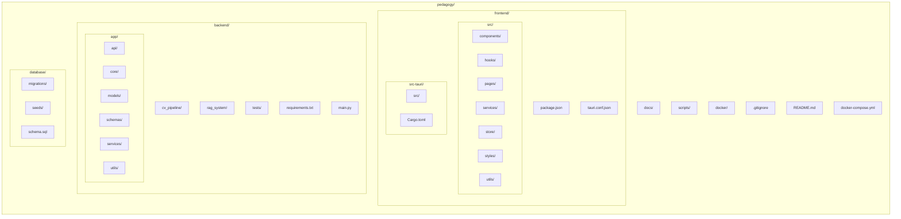
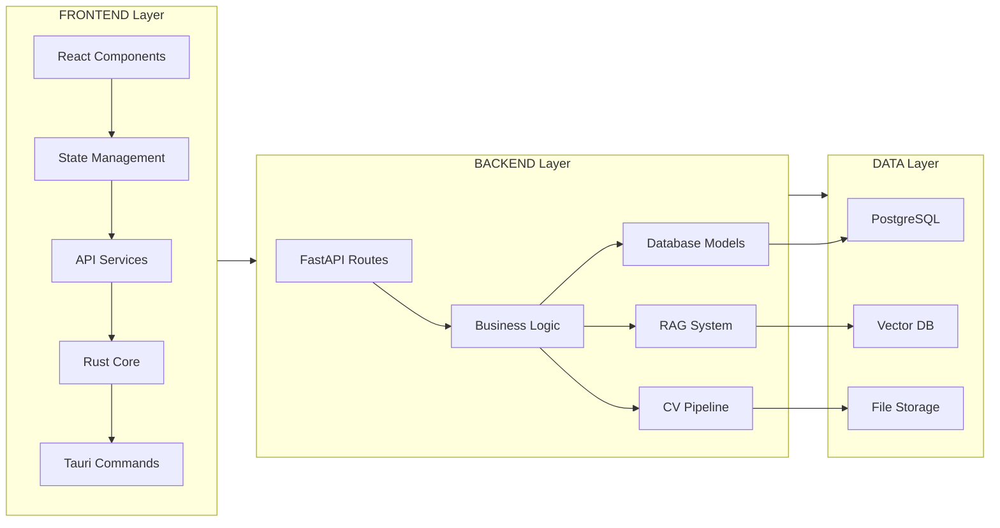

# Pedagogy - Project Scaffolding & Implementation Phases

## Project Structure Overview

The project consists of three main components:

**Frontend (Tauri + React)**: Contains the user interface components, React hooks, pages, services, state management, styles, and utilities. The Rust core layer handles native desktop functionality.

**Backend (Python FastAPI)**: Houses the API endpoints, core configuration, database models, schemas, services, and utilities. Also includes the Computer Vision pipeline and RAG knowledge system.

**Supporting Infrastructure**: Database scripts with migrations and seeds, documentation, build/deploy scripts, and Docker configurations.

## Project Directory Structure Diagram

## Directory Structure - Detailed View

---

## Implementation Phases Overview

The project is divided into 8 sequential phases:

- Phase 1: Project Setup & Core Infrastructure
- Phase 2: Authentication & Organisation Management
- Phase 3: Knowledge Base & RAG System
- Phase 4: Computer Vision Pipeline
- Phase 5: Screen Capture & Hotkey System
- Phase 6: AI Guidance Engine
- Phase 7: Halo Overlay System
- Phase 8: Integration, Testing & Deployment

---

# Phase 1: Project Setup & Core Infrastructure

## 1.1 Objectives

- Set up development environment
- Initialize project repositories
- Configure database
- Create basic project structure

## 1.2 Directory Structure

The frontend directory contains the React application source code (App.tsx, main.tsx) and the Tauri Rust layer (main.rs, lib.rs, Cargo.toml, tauri.conf.json). Configuration files include package.json, tsconfig.json, and vite.config.ts.

The backend directory contains the FastAPI application with main.py and config.py, along with requirements.txt and environment configuration.

The database directory contains migration scripts and the main schema file.

Root-level files include .gitignore, README.md, and docker-compose.yml.

## 1.3 Tasks

**Task 1.3.1: Initialize Frontend (Tauri + React)**
Create a new Tauri project with React template, install dependencies including React Query, Axios, Zustand, and TailwindCSS. Configure the package.json with development scripts and set up the Cargo.toml with required Rust dependencies for Tauri, Serde, Tokio, Reqwest, and screenshots.

**Task 1.3.2: Initialize Backend (FastAPI)**
Create the backend directory structure, set up a Python virtual environment, and install FastAPI, Uvicorn, SQLAlchemy, AsyncPG, Pydantic, and related packages. Create the main FastAPI application with CORS middleware and a health check endpoint.

**Task 1.3.3: Database Setup**
Create the PostgreSQL schema with UUID and vector extensions. Define the initial tables for organisations and users with appropriate indexes. Set up Docker Compose with pgvector image for vector search capabilities.

## 1.4 Phase 1 Checklist

- Initialize Tauri + React frontend
- Initialize FastAPI backend
- Set up PostgreSQL with pgvector
- Configure Docker Compose
- Set up Git repository
- Create basic health check endpoints

---

# Phase 2: Authentication & Organisation Management

## 2.1 Objectives

- Implement user authentication (JWT)
- Build organisation registration/onboarding
- Create user management APIs
- Set up role-based access control

## 2.2 Directory Structure

The backend API directory expands to include auth.py, organisations.py, and users.py. The core directory adds security.py and dependencies.py. Models directory includes organisation.py and user.py. Schemas directory mirrors with auth.py, organisation.py, and user.py. Services directory adds auth_service.py and org_service.py.

## 2.3 Tasks

**Task 2.3.1: Authentication Models & Schemas**
Create the User SQLAlchemy model with fields for user_id, org_id, email, password_hash, full_name, role, is_active, email_verified, created_at, and last_login. Define Pydantic schemas for UserRegister, UserLogin, Token, and TokenPayload.

**Task 2.3.2: Security Module**
Implement password hashing using bcrypt, JWT token creation for access and refresh tokens, and token decoding/verification functions.

**Task 2.3.3: Auth API Endpoints**
Create API routes for /auth/register, /auth/login, /auth/logout, and /auth/refresh with proper request/response handling.

**Task 2.3.4: Organisation Management**
Build API endpoints for /org/onboard and /org/profile with corresponding service layer logic. Since Pedagogy is deployed as a single-tenant instance per organisation, there is no need for organisation listing or switching.

## 2.4 Frontend Components

Create an API service module with Axios configuration, request interceptors for authentication tokens, and API methods for auth operations (register, login, logout, refresh, me) and organisation operations (onboard, profile).

## 2.5 Phase 2 Checklist

- Create User & Organisation models
- Implement JWT security module
- Build auth API endpoints
- Build organisation API endpoints
- Create frontend auth services
- Build login/register UI components
- Implement token refresh logic
- Add role-based access control

---

# Phase 3: Knowledge Base & RAG System

## 3.1 Objectives

- Build document upload and processing
- Implement text chunking and embedding
- Set up vector database (ChromaDB/pgvector)
- Create RAG search functionality

## 3.2 Directory Structure

Create a new rag_system directory containing document_parser.py, chunker.py, embedder.py, vector_store.py, and retriever.py. Add knowledge.py to the API directory, knowledge_base.py/document.py/embedding.py to models, and knowledge_service.py to services.

## 3.3 Tasks

**Task 3.3.1: Document Parser**
Build an abstract DocumentParser class with concrete implementations for PDF (using PyMuPDF), DOCX (using python-docx), and Markdown files. Create a ParserFactory to select the appropriate parser based on file extension.

**Task 3.3.2: Text Chunker**
Implement a TextChunker class that splits documents into overlapping chunks of configurable size, finding natural break points at sentence boundaries.

**Task 3.3.3: Embedding Generator**
Create an Embedder class using SentenceTransformers (all-MiniLM-L6-v2 model) to generate vector embeddings for text chunks, supporting both single and batch embedding operations.

**Task 3.3.4: Vector Store**
Implement a VectorStore class for storing embeddings in PostgreSQL with pgvector, including methods for inserting embeddings and performing similarity searches scoped by organisation.

**Task 3.3.5: RAG Retriever**
Build a RAGRetriever class that combines the embedder and vector store to retrieve relevant documents based on query similarity, with configurable top-K and minimum similarity threshold.

**Task 3.3.6: Knowledge API**
Create API endpoints for /org/upload-knowledge (multipart file upload with processing) and /query/rag (semantic search).

## 3.4 Phase 3 Checklist

- Implement document parsers (PDF, DOCX, MD)
- Build text chunking system
- Set up SentenceTransformers embedder
- Implement pgvector storage
- Build RAG retriever
- Create knowledge upload API
- Create RAG search API
- Build instruction step extractor

---

# Phase 4: Computer Vision Pipeline

## 4.1 Objectives

- Set up YOLO for UI element detection
- Implement PaddleOCR for text extraction
- Build screen state fusion engine
- Create CV processing API

## 4.2 Directory Structure

Create a cv_pipeline directory containing preprocessor.py, yolo_detector.py, ocr_engine.py, context_engine.py, and a models subdirectory for the YOLO model weights.

## 4.3 Tasks

**Task 4.3.1: Image Preprocessor**
Build an ImagePreprocessor class that handles image decoding, resizing to target resolution while maintaining aspect ratio, color normalization, and contrast enhancement using CLAHE.

**Task 4.3.2: YOLO UI Detector**
Implement a YOLODetector class using Ultralytics YOLO to detect UI elements (buttons, inputs, checkboxes, dropdowns, text, tables, menus, modals, icons, links) and return their bounding boxes with confidence scores.

**Task 4.3.3: OCR Engine**
Create an OCREngine class using PaddleOCR to extract text from images, returning text regions with their bounding boxes and confidence scores. Include a method to extract text from specific regions.

**Task 4.3.4: Context Engine**
Build a ContextEngine class that orchestrates preprocessing, YOLO detection, and OCR extraction, then fuses the results by matching detected UI elements with their text labels based on bounding box overlap.

## 4.4 Phase 4 Checklist

- Build image preprocessor
- Set up YOLO UI detector
- Implement PaddleOCR engine
- Build context fusion engine
- Train/fine-tune YOLO on UI elements
- Create capture context API
- Optimize for performance

---

# Phase 5: Screen Capture & Hotkey System

## 5.1 Objectives

- Implement screenshot capture functionality (Rust)
- Create global hotkey listener
- Build capture UI components
- Integrate capture flow with guidance system

## 5.2 Directory Structure

Expand the Tauri Rust source with a capture module containing mod.rs, screenshot.rs, and hotkey.rs. Add a commands module with mod.rs and capture_commands.rs.

## 5.3 Tasks

**Task 5.3.1: Screenshot Capture (Rust)**
Create a ScreenCapture module with methods for capturing the primary screen at full resolution (for CV processing), returning base64-encoded PNG data. Handle high-DPI displays and multi-monitor setups.

**Task 5.3.2: Hotkey Listener (Rust)**
Implement a global hotkey listener that registers configurable hotkeys (default: Ctrl+Shift+P) and triggers screen capture. Support hotkey customization through user settings.

**Task 5.3.3: Tauri Commands**
Expose Rust functions as Tauri commands: capture_screenshot, register_hotkey, and unregister_hotkey.

**Task 5.3.4: Capture UI Components**
Build React components for the capture interface including a "Capture Screen" button, capture status indicator, and hotkey configuration in settings.

## 5.4 Phase 5 Checklist

- Build screenshot capture module
- Implement global hotkey listener
- Create Tauri commands for capture operations
- Build capture UI button and status components
- Add hotkey configuration to settings
- Integrate with backend capture API

---

# Phase 6: AI Guidance Engine

## 6.1 Objectives

- Build element-to-instruction matcher
- Implement AI reasoning with LLM
- Create guidance generation system
- Build step tracking logic

## 6.2 Directory Structure

Create an ai_engine subdirectory in the app folder containing matcher.py, reasoner.py, and guidance_generator.py. Add guidance.py to the API directory and guidance_service.py to services.

## 6.3 Tasks

**Task 6.3.1: Element Matcher**
Build an ElementMatcher class that matches instruction steps to detected UI elements using text similarity (SequenceMatcher) for labels and type compatibility checking.

**Task 6.3.2: AI Reasoner**
Implement an AIReasoner class that constructs prompts combining the user query, detected screen elements, and retrieved knowledge base instructions, then calls an LLM (Llama-3 via Ollama or cloud API) to determine the next action.

**Task 6.3.3: Guidance API**
Create API endpoints for /infer/guidance (generate guidance based on session state) and /infer/steps/{session_id} (retrieve steps for a session).

## 6.4 Phase 6 Checklist

- Build element-to-instruction matcher
- Implement AI reasoner with LLM
- Create guidance generator
- Build guidance API endpoints
- Implement step tracking
- Add confidence scoring

---

# Phase 7: Halo Overlay System

## 7.1 Objectives

- Build transparent overlay window
- Implement halo rendering (glow, pulse)
- Create tooltip system
- Handle overlay positioning

## 7.2 Directory Structure

Create a HaloOverlay component directory in the frontend containing HaloOverlay.tsx, HaloElement.tsx, Tooltip.tsx, and styles.css. Add useHaloOverlay.ts to the hooks directory.

## 7.3 Tasks

**Task 7.3.1: Halo Overlay Component**
Build the main HaloOverlay React component that receives halo targets and renders them when visible.

**Task 7.3.2: Halo Element Component**
Create the HaloElement component that renders individual highlights with positioning based on bounding boxes, animation classes based on style type, and tooltip display.

**Task 7.3.3: Halo Styles**
Implement CSS animations for three halo styles: glow (purple with box-shadow pulsing), pulse (green with expanding ring animation), and outline (amber dashed border).

**Task 7.3.4: Tauri Overlay Window**
Configure Tauri to create a transparent, always-on-top, fullscreen overlay window that ignores cursor events (click-through). Add Tauri commands for show_halos, hide_halos, and update_halos.

## 7.4 Phase 7 Checklist

- Build HaloOverlay component
- Create HaloElement with animations
- Implement tooltip system
- Set up Tauri overlay window
- Handle click-through behavior
- Add multiple halo styles
- Build halo API integration

---

# Phase 8: Integration, Testing & Deployment

## 8.1 Objectives

- Integrate all system components
- Write unit and integration tests
- Perform end-to-end testing
- Fix bugs and optimize performance
- Build & package application
- Deployment preparation

## 8.2 Tasks

**Task 8.2.1: Integration Tests**
Write backend integration tests that verify the full guidance flow: user login, query submission, screen capture, CV processing, and generating guidance with halo targets.

**Task 8.2.2: Frontend Tests**
Create React component tests for the HaloOverlay to verify rendering behavior when visible/hidden and with different target configurations.

**Task 8.2.3: Build Configuration**
Configure Tauri build settings including product name, version, bundle identifier, icons for all platforms, and target formats (MSI, NSIS for Windows, DMG and App for macOS).

**Task 8.2.4: Docker Production Config**
Create production Dockerfiles for the backend service using Python 3.11 slim image with Uvicorn server.

## 8.3 Phase 8 Checklist

- Write backend unit tests
- Write frontend unit tests
- Create integration tests
- Perform E2E testing
- Performance optimization
- Bug fixes
- Code review
- Configure build settings
- Create production Docker configs
- Write user documentation
- Create installer packages
- Final testing
- Release preparation

---

## Summary: All Phases

- Phase 1: Project Setup & Core Infrastructure - 6 tasks
- Phase 2: Authentication & Organisation Management - 8 tasks
- Phase 3: Knowledge Base & RAG System - 8 tasks
- Phase 4: Computer Vision Pipeline - 7 tasks
- Phase 5: Screen Capture & Hotkey System - 6 tasks
- Phase 6: AI Guidance Engine - 6 tasks
- Phase 7: Halo Overlay System - 7 tasks
- Phase 8: Integration, Testing & Deployment - 13 tasks

**Total: 61 Tasks**

---

## How to Use This Document

1. **Track Progress**: Mark tasks as completed as you work through each phase
2. **Sequential Execution**: Complete phases in order as dependencies exist between them
3. **Parallel Work**: Some tasks within a phase can be done simultaneously
4. **Adapt as Needed**: Modify the structure based on actual requirements discovered during development
